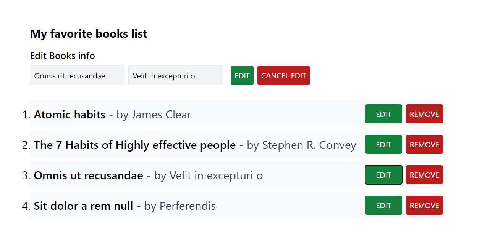

# Favorite Book List App with Redux Toolkit

This project is a single-page application built with TypeScript, React, Tailwind CSS, and Redux Toolkit. It allows users to manage a list of their favorite books, showcasing efficient and streamlined state management with Redux Toolkit.

## Features

- **TypeScript:** Strongly typed codebase for enhanced reliability and maintainability.
- **React:** Component-based architecture for modular and reusable UI components.
- **Tailwind CSS:** Utility-first CSS framework for rapid UI development.
- **Redux Toolkit:** Simplified state management with minimal boilerplate.
- **CRUD Operations:** Add, update, delete, and display favorite books with ease.

## Date of Completion

Completed on August 4, 2024

## Live Site

Check out the live version of the project [here](https://favorite-boolist-redux-crud.vercel.app/).

## Project Image

